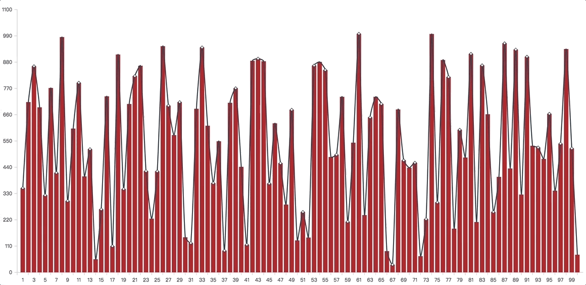

<p align="center">
    <br/>
</p>

# 教你开发图表库fchart系列第一章

[工程分支](https://github.com/sheweichun/fchart/blob/Chapter_One/dev_doc/Chapter_One.md)

整个系列里作者会带着大家一起完成一个从0到1图表库的开发，欢迎来[这里](https://github.com/sheweichun/fchart)踊跃拍砖

估计很多人会问，现在开源世界里的图表库多如牛毛，为什么自己还要再弄个图表库呢?
* 开发库很多不假，但是成熟的框架都是大而全的，学习成本高，而实际业务中使用的图表都是比较简单的，尤其是移动端更是要求精简，但即便简单的图表也会掺杂个性化的需求，这个时候受框架的限制你会有一种无力感
* 这时候如果你自己有一一套基础图表库，既能满足日常的业务开发，又能满足老板对可视化个性化定制，会让你觉得生成如此惬意~~
* 当然如果最后这个库开发失败了，就权当学习好了


在具体开始撸代码之前，我们需要想清楚图表的组成部分，这个库的架构是怎样的，开发者如何使用等等，形象点说就是我们先弄一个施工图出来


## Demo演示
下面这个动图就是我们本次要实现的效果,包含了X轴、Y轴、折线图、柱形图和动画




## 图表组成

限于我们的图表现在还没整出来，我们走一次抽象派，见下图


这是图展示了一个最基本的图表的组成部分(**我们由浅入深**)，它包含以下部分:

* X轴
* Y轴
* 绘制区域
* 各种类型图
* 图例
* 提示信息
* 辅助元素
* 标题、副标题


## 初步建模


## 编程语言选择

选择typescript，好处有一下几点
* 增强代码的可读性和可维护性
* 增强了编辑器和 IDE 的功能，包括代码补全、接口提示、跳转到定义、重构等
* 未来开发者使用的时候能够做到配置自动提示


## Coding

### 坐标轴

由前面图分析，我们会提供基础Axis，然后在Axis上分别抽象出YAxis,XAxis

#### [Axis]((https://github.com/sheweichun/fchart/blob/a8fd713e0d3939cea8bb65bdad44ed7ca82f3fc4/src/widgets/axis.ts#L212))

* 构造函数

```typescript
...
constructor(opt:AxisOpt){
    this.data = (opt.data || []) as string[]
    const mergeOpt = assign({},defaultAxisOpt,opt || {}) as AxisOpt;
    const {x,y,length,axisTick,axisLabel,axisLine,horizontal,reverse,splitNumber,boundaryGap} = mergeOpt;
    this.boundaryGap = boundaryGap;
    this.x = x;
    this.y = y; 
    const dLen = this.data.length - 1
    const rSplitNumber =  splitNumber || dLen;
    this.tickUnit = Math.ceil(dLen / rSplitNumber); // tick之间包含的数据点个数,不包含最后一个
    this.unitWidth = length / (dLen + ( this.boundaryGap ?  this.tickUnit : 0)); //每个数据点之间的距离
    this.tickWidth = this.tickUnit * this.unitWidth; //每个tick的宽度
    this.length = length;
    this.axisTickOpt = assign({},defaultAxisTick,axisTick || {})
    this.axisLabelOpt = assign({
        fontSize:Global.defaultConfig.text.fontSize,
        fontFamily:Global.defaultConfig.text.fontFamily,
        fontWeight:Global.defaultConfig.text.fontWeight,
        color:Global.defaultConfig.text.color
    },defaultAxisLabel, axisLabel || {});
    this.axisLineOpt = assign({},defaultAxisLine, axisLine || {});
    this.parseStartAndEndPoint(mergeOpt);
    if(horizontal){
        this.textAlign = "center";
        this.textBaseline = reverse ? "bottom" : "top";
        this.createHorizontatickAndLabels(mergeOpt)
    }else{
        this.textAlign = reverse ? "left" : "right";
        this.textBaseline = "middle";
        this.createVerticatickAndLabels(mergeOpt);
    }
}
...
```

###


### 配置tsconfig.json
```json
{
	"compilerOptions": {
		"module": "commonjs",
		"target":"es5",
		"outDir": "lib",
		"rootDir": "src",
		"lib": ["es2017","dom"],
		"sourceMap": false,
		"composite": true
	},
	"include": ["src"],
	"exclude": ["node_modules", ".vscode"]
}
```

### 安装typescript
```bash
npm install typescript -D
```


### package.json里配置开发和编译命令
```json
{
    "scripts":{
      ...
      "watch":"tsc -w", //开发用，实时编译生成js
      "build":"tsc" //构建用，生成js
    }
}
```

如果你是typescript新手，建议你上官网[中文官网](https://www.tslang.cn/)学习学习

## 开发

选用parcel开箱即用的解决方案，不熟悉的同学如果对parcel感兴趣可以去[官网](https://parceljs.org)了解了解，没兴趣也没关系，按照以下指示也是能跑起demo来的


### 创建demo目录

### demo目录下创建index.html

```html
<!DOCTYPE html>
<html lang="en">
<head>
    <meta charset="UTF-8">
    <meta name="viewport" content="width=device-width, initial-scale=1.0">
    <meta http-equiv="X-UA-Compatible" content="ie=edge">
    <title>Document</title>
</head>
<body>
    <canvas width="600" height="400" id="demo"></canvas>
    <script src="./index.js"></script>
</body>
</html>
```

### demo目录下创建index.js


```javascript
import Fchart from '../lib/index';
/** 
 * 待测试Demo
const canvas = document.getElementById('demo');
const chart = new Fchart(canvas,{
    title:'Title',
    subTitle:'subTitle',
    xAxis:{
        data:[1,2,3,4,5,6,7,8,9,10]
    },
    series:[
        {
            type:'line',
            data:[
                20,30,10,2,6,29,50,29,34,18
            ]
        }
    ]
})
**/
```
### 安装parcel
```bash
npm install parcel-bundler -D
```

### package.json里配置demo命令
```json
{
    "scripts":{
        "dev":"parcel demo/index.html",
        ...
    }
}
```

### 开发预览demo

```bash
npm run dev
```


> 


